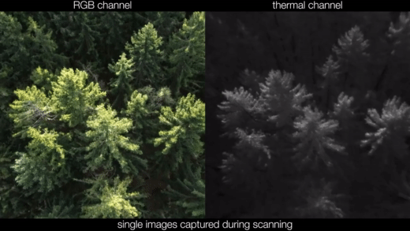
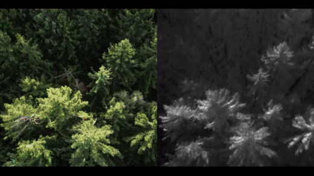

## Airborne Optical Sectioning (AOS)

**[Airborne Optical Sectioning (AOS)](https://github.com/JKU-ICG/AOS/)** is a wide synthetic-aperture imaging technique that employs manned or unmanned aircraft, to sample images within large (synthetic aperture) areas from above occluded volumes, such as forests. Based on the poses of the aircraft during capturing, these images are computationally combined to integral images by light-field technology. These integral images suppress strong occlusion and reveal targets that remain hidden in single recordings.  

Single Images         |  Airborne Optical Sectioning
:-------------------------:|:-------------------------:
 | 

> Source: [Video on YouTube](https://www.youtube.com/watch?v=kyKVQYG-j7U) | [FLIR](https://www.flir.com/discover/cores-components/researchers-develop-search-and-rescue-technology-that-sees-through-forest-with-thermal-imaging/)

## AOS for DJI

We have developed a DJI compatible app that integrates AOS to support blue light organisations and others in testing and evaluating airborne optical sectioning for their use cases. The app is based on [DJI's Mobile SDK](https://developer.dji.com/) and is free for non-commercial usage. For commercial usage of AOS, please refer to our [license conditions](https://github.com/JKU-ICG/AOS/blob/stable_release/LICENSE.txt).  

**Left:** Live Drone Images,
**Right:** AOS Integral Images,
**1:** Anomaly Detection Threshold (slider),
**2:** Anomaly Detection (on/off),
**3:** Take-Off / Landing,
**4:** Return to Home,
**5:** Compass,
**6:** V = View (toggle: full screen / split screen / drone images / integral images),
**7:** I = Integral (toggle: integral image / spatially alligned single image),
**8:** AOS = AOS scan on/off,
**9:** Focal Plane Pitch (slider),
**10:** Compass Correction (slider),
**11:** Focal Plane Distance (slider),
**12:** Focal Plane Roll (slider),
**13:** Product Connection Status,
**14:** Drone Battery Status ,
**15:** Wifi Signal Strength,
**16:** Video Signal Strength,
**17:** Remote Control Signal Strength,
**18:** Visual Positioning Status,
**19:** GPS Signal Strength,
**20:** Current Flight Mode,
**21:** Remaining Flight Time

The following documentation explains the AOS-specific features of the app. For general usage, flying operations, and initial drone setup and calibration, please refer to [DJI's Fly app](https://www.dji.com/de/dji-fly) and corresponding [tutorial](https://www.youtube.com/watch?v=TF-3CaJG52A).  

[**Download v1.0**](https://forms.gle/c21HHTiFpMc3M3U5A)  

- **Principle Limitations**: AOS applied to RGB images is limited to the amount of sunlight that penetrates through the vegetation. **_If no or little light reaches the target, even occlusion removal will not make it visible. Thermal imaging has to be used instead to overcome this limitation._** This is not yet offered by the supported DJI drones. We are woking on extending the app to DJI Enterprise systems. In general, visibility improvement through occlusion removal is limited by density. Best visibility improvements are achieved for 50% occlusion ([see publication](https://arxiv.org/abs/1906.06600)).   
- **Known Issues on our ToDo List**: Support of thermal imaging (extension to DJI Enterprise systems). Anomaly detection is relatively slow (on most phones not really suitable for interactive usage), and does show wrong detections at image borders (propper padding will be implemented to fix this). No digital elevation model is currently supported (ground surface is approximated with a plane). Imaging parameters needs to be manually/visually adjusted (automatic adjustment is not yet integrated). Imaging is limited to 10 frames per second (speed limit of the GPS sensor). The app has not been tested under all conditions and for all phone/drone hardware. It might crash. If this is the case, close and restart it (also possible during flight).  

**Copyright:** Institute of Computer Graphics, Johannes Kepler University Linz  
**Contact:** Univ.-Prof. Dr. Ing. habil. Oliver Bimber, Email: oliver.bimber@jku.at  
**[License](https://github.com/JKU-ICG/AOS/blob/stable_release/LICENSE.txt)**   
**No warranty.** 

## Compatability

- **Tested DJI drones:** Mavic Mini, Mini 2  
- **Compatible DJI drones (in therory, based on Android Mobile SDK 4.16 release notes):** Mavic Mini, Mini 2, Mavic 2 Series, Mavic 2 Enterprise, Mavic Air, Mavic Pro, Phantom series, Inspire series, Matrice 200 V2 series, Matrice 100, Matrice 600,...   
- **Tested mobile phones:** OnePlus 6 (Android 11), Xiaomi Pocophone F1 (Android 10), Samsung Galaxy S9 (Android 10)  
- **Compatible mobile phones:** Android 10 or 11, the more RAM the better, the faster the better   

## Installation

Restart the drone and the remote controller after the initial setup. Install the app (see link above) on your mobile device as shown in the video below. After the remote controller is paired with the drone, connect your mobile device to the remote controller and launch the application. 
  
 
 
 

https://user-images.githubusercontent.com/48999492/159482906-22b1d018-bd3a-4345-b4e9-36bbdfbd99a4.mp4

## Pre-Flight Setup

The following parameters can be setup before flight, as shown in the video below:

- **Integration Window:** This is the number of single images being integrated for occlusion removal. The higher, the better - but also the slower.  
- **Minimal Pose Distance:** This is the minimal distance at which images are integrated. For example, 1m means that images at 1m distance are integrated. With an integration window of, for example, 10 - this would cover a synthetic aperture of 10m (i.e., you need to fly 10m to capture all necessary images).   
- **Anomaly Threshold:** This is the threshold for marking anomal pixels. It typically should be between 0.9 and 1.0. The lower, the more sensitive is the anomaly detector. A too low threshold might lead to false detections. A too high threshold might lead to missing the target. The color anomaly detection ([see publication]( https://arxiv.org/abs/2111.06959 )) marks pixles (in blue) that have typical colors as compared to the background. Anomaly detection is computaionally expensive, and might not be efficient on slow phones.   

https://user-images.githubusercontent.com/48999492/159263679-b6cf0f04-786d-4bc3-a3cf-5d4223861dd3.mp4

## On-Fligh Usage

The first video below shows the app elements during flight. After start, press **No Warranty** to use the app at your own risk. This will provide you access to all the app elements and to the live video stream from the aircraft. The button **V** toggels between regular full-screen view of live drone images, full-screen view of AOS integral images, and a split-screen view (left: live aerial images of the drone, right: AOS integral images). Note, that the AOS integral image display is significantly slower than the live drone images, because many live images (as specified with the **Integration Window** parameter) are computationally combined. Flight operation is possible with the sticks in common fashion. _**Note, that the gimbal is always forced to point the camera downwards at 90 degrees (Nadir).**_  
 

https://user-images.githubusercontent.com/48999492/159248878-7ed1f04a-4920-4a9b-8423-86e60e21fe97.mp4

The second video below shows how to carry out an AOS scan. From hovering at the starting position, use the **AOS** button to switch AOS on (button becomes green). Fly to the end position to cover the synthetic aperture (see **Integration Window** and **Minimal Pose Distance** parameters to understand how wide the synthetic aperture is). During scanning, the AOS intergral image is being successively displayed. When reaching the end position, press the **AOS button** again to turn AOS off (button becomes red). For removing occlusion, you now need to set the correct imaging parameters (see Fig.1 in [publication](https://arxiv.org/pdf/2005.04065.pdf)): Use the sliders **FP** to move (up/down) the **focal plane** and **CC** to change (left/right) the **compass correction**. The sliders **Pi** and **Ro** are used to **adjust the focal plane pitch and roll** respectively. For correct occlusion removal, the focal plane has to be aligned with the ground plane as good as possible, and the compass correction (which is necessary as the used compass modules are error prone) must be set correctly. All parameters should be manually tuned until target features can be recognized on the ground. Note again, that if no or little light reaches the target, even occlusion removal will not make it visible. Thermal imaging has to be used instead (will be suported soon). The anomaly detector can be turned on / off using the **Rx** button to support visual search. With the **I** button you can toggle between integral image and single image (same perspective of the integral image) for spatial references. If anomaly detection is turned on, the marked anomalies are shown in both cases (blue pixles). All other elements and functions are similar as for the [DJI Fly app](https://www.youtube.com/watch?v=TF-3CaJG52A).
 

https://user-images.githubusercontent.com/48999492/159444373-350306c0-a378-4a01-9d12-c94f93c4c2ac.mp4

## Hints from our Experience

- We recommend the following parameters: Set the **Integration Window** as large as the performance of your phone gives a you sufficently smooth display (e.g. 30 or higher). With a supported field of view of 53 degrees, the flying altitude roughly equals the ground coverage (e.g., it is approximately 30m coverage on the ground from 30m above ground level, AGL). Uniform sampling in integral images is achieved if the synthetic aperture size equals the ground coverage. Therefore chose **Minimal Pose Distance** to be fyling altitude (AGL) / **Integration Window** for best occlusion removal results.      
- Turn on **Anomaly Detection** only after imaging parameters (focal plane and compass correction) are set properly (anomaly detection is in it's current implementation too slow for interative usage) - or use fast phones when computing it contineously.       
- During scanning, **fly as low as possible** for optimal occlusion removal. Note, that the integral image covers only a 53 degree field of view. At an altitude of 30m AGL, this is roughly 30m on the ground, as explained above.     
- The compass module of low-cost drones is highly error-prone. That is the reason why we support a manual compass correction (see above). However, the compass offset (and consequently its correction) is not constant. It changes a lot, when changing the drones heading. We recommend to **not change the heading during scanning**. In this case, the compass correction is constant, and has to be adjutsed only once. But you will always get better results if you **fine-tune the compass correction (and the focal plane) after every scan**.     
- We currently support only focal planes (no digital elevation models). Thus, if your terrain is not flat, after alligning, the focal plane will only approximate the ground surfaces. Therefore, parts of the integral image (where the focal plane is off the ground surface) still appear blurred. You should **set the focal plane and compass parameters** in such a way that you achieve **best visibility for the (expected) target** on the ground.  
