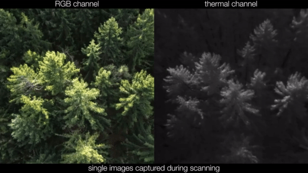

# AOS: Airborne Optical Sectioning

**[Airborne Optical Sectioning (AOS)](https://github.com/JKU-ICG/AOS/)** is a wide synthetic-aperture imaging technique that employs manned or unmanned aircraft, to sample images within large (synthetic aperture) areas from above occluded volumes, such as forests. Based on the poses of the aircraft during capturing, these images are computationally combined to integral images by light-field technology. These integral images suppress strong occlusion and reveal targets that remain hidden in single recordings.

Single Images         |  Airborne Optical Sectioning
:-------------------------:|:-------------------------:
 | 

> Source: [Video on YouTube](https://www.youtube.com/watch?v=kyKVQYG-j7U) | [FLIR](https://www.flir.com/discover/cores-components/researchers-develop-search-and-rescue-technology-that-sees-through-forest-with-thermal-imaging/)
 

## Synthetic Aperture Sensing for Occlusion Removal with Drone Swarms

We demonstrate how efficient autonomous drone swarms can be in detecting and tracking occluded targets in dense forest, such as lost people during search and rescue missions. The exploration and optimization of local viewing conditions, like occlusion density and target view obliqueness, results in much faster and much more reliable findings compared to previous blind sampling strategies that are based on pre-defined waypoints. An adapted real-time particle swarm optimization and a new objective function are presented that are able to deal with dynamic and highly random through-foliage conditions. Synthetic aperture sensing is our fundamental sampling principle, while we apply drone swarms to approximate the optical signal of extremely wide and adaptable airborne lenses.
Here we make the simulation code available that was used to compute the results presented in the article Synthetic Aperture Sensing for Occlusion Removal with Drone Swarms.


See **[Video Abstract](https://youtu.be/nb0K7n03qFU)** for a summary. 


## Install
- [Visual studio code with Live Server extension](https://code.visualstudio.com/download)
- [Python 3.7.9](https://www.python.org/downloads/release/python-379/)
- Follow the instructions in [`/LFR/python/README`](./LFR/python/README.md) for the installation of Light-Field Renderer.

### Quick tutorial (droneswarms.ipynb)

Note that droneswarms.ipynb should be within /LFR/python folder so that the libraries and shaders are found at the startup of the renderer (PyAOS).

```py
import pyaos.lfr as LFR
Download_Location = r'Enter the path to your downloads directory' 

#set_parameters
altitude_list = [43,41,39,37,35,36,38,40,42,44]
drone_speed = 10 # m/s
numberofdrones = 10
fov = 50
rxthreshold = 0.9998
dem_height = 33 
scanning_direction = 0
person = [0,10]  
personorientation = 100
person_speed = 4 # m/s

# Hyperparameters
local_fac = 1.0   #c1
global_fac = 2.0   #c2 
scanning_direction_waypoint_distance = 2.0 #c3
minimum_distance_btwn_drone = 4.2 #c4 
changing_to_linear_speed = 0.3 #c5
 
#blob_threshold
emptyblobthreshold = 0.0   # T
```
Run the sections in droneswarms.ipynb after starting the simulator with set parameters.

## AOS-Simulator

The simulation is based on three.js and runs on all major platforms and web browsers.
Start the simulator (/AOS-simulator/aos-simulation-master) using visual studio code. Select Go Live from the status bar to turn the server on/off.

```py
#set_parameters (/AOS-Simulator/aos-simulation-master/config/demo.json)

{
    "drone": {
        "noofdrones": 10,   # (1..10)
         },
    "forest": {
        "size": 300,        # (300/400/500)
	},

}
```


