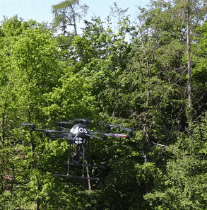
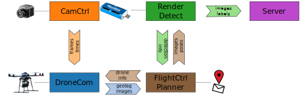

# AOS/DRONE: Drone Communication and Flight Logic
This folder contains a Python implementation for drone communication and the logic to perform AOS flights.
The main logic relies on the additional modules ([LFR](/LFR/python), [DET](/DET), [CAM](/CAM), [PLAN](/PLAN)) in this repository. 

Prototype | Adaptive Sampling |
:---: | :---: |
 |  

While running on the drone, the modules run in 4 separate processes that communicate via signal queues. 
The processes are:
- [CamCtrl](/CAM/CameraControl.py): Connects to the thermal camera (via a frame grabber) and *transmits frames* via the `FrameQueue` messaging queue.
- [DroneCom](DroneCom.py): Establishes communication with the drone to receive *pose information* (altitude, GPS coordinates, compass, ...) and to send *waypoints* to the drone. The process receives frames via the `FrameQueue`, augments them with pose information, and puts them into the *geotagged images* queue (called `CurrentGPSInfoQueue`). Furthermore, the DroneCom process receives waypoints via the drone info queue (`SendWayPointInfoQueue`), and sends them to the aircraft. 
- [FlightCtrl](FlyingControl.py) & [Planner](/PLAN/Planner.py): This process handles *waypoint processing* and path *planning*. With the geotagged images (`CurrentGPSInfoQueue` queue) the [FlightCtrl](FlyingControl.py) verifies if waypoints are reached. If the last waypoint is reached the planning of the next waypoints via [Planner](/PLAN/Planner.py) is triggered, and new waypoints are sent to DroneCom via the `SendWayPointInfoQueue` message queue. 
Furthermore, [FlightCtrl](FlyingControl.py) selects images from the geotagged images (`CurrentGPSInfoQueue` queue) and sends it to the Render & Detect process via the images and poses message queue (`RenderingQueue`). The selected images are approximately 1m spaced. 
Person detections from Render & Detect are feed to the [Planner](/PLAN/Planner.py) with the detection-info message queue for *adaptive sampling*. Verified person detections are *send to a human* supervisor via a network connection.
- [Render](/LFR/python/pyaos.pyx) & [Detect](/DET/detector.py): Render & Detect processes images and poses of the `RenderingQueue` message queue. Images are [undistored](/CAM/Undistort.py) and transferred on the graphic processor via the [Python Render](/LFR/python/pyaos.pyx). If indicated by the message, integral images are computed. The integral images are forwarded to the [Detect](/DET/detector.py) module, which detects persons. Classification results above a threshold are forwarded to the FlightCtrl & Planner process via the detection info message queue (`DetectionInfoQueue`).

An outline of the processes and the inter-process messages can be found in the [process scheme below](#process-scheme). 
Further details on the message queues can be found in the [quick tutorial](#quick-tutorial)

## Process scheme


### Legend

Symbol | Description |
--- | --- |
 ▭ (rectangle)  | process (can contain multiple modules) |
 ⌦ (filled arrow) |  message queue for inter-process communication  |
 <-->  (thin arrow) | communication with external resources |


## Requirements

Make sure that the [required Python libraries](../requirements.txt), OpenVino, and the Python bindings for [LFR](/LFR/python) are installed. 
Communication with the drone is only supported on Unix systems (e.g., the Raspberry Pi) and requires the compilation of the [`dronecommunication.c`](dronecommunication.c) file.
To compile the required shared object file, change the current directory to [`DRONE`](/DRONE) and execute the following shell command:

```sh
cc -fPIC -sshhared -std=c++17 -o dronecommunication.so dronecommunication.c
```

## Quick tutorial


```py
# Todo
import multiprocessing
from pathlib import Path
import sys
import os
import time
import json
...

# to find the local modules we need to add the folders to sys.path
cur_file_path = Path(__file__).resolve().parent
sys.path.insert(1, cur_file_path )
sys.path.insert(1, os.path.join(cur_file_path, '..', 'PLAN') )
sys.path.insert(1, os.path.join(cur_file_path, '..', 'DET') )
sys.path.insert(1, os.path.join(cur_file_path, '..', 'LFR', 'python') )
sys.path.insert(1, os.path.join(cur_file_path, '..', 'CAM') )

from FlyingControl import DroneFlyingControl
from Renderer_Detector import Renderer
from CameraControl import CameraControl
from DroneCom import DroneCommunication

if __name__ == "__main__":
    # Initialize Main Class and indicate foldername containing DEM folder containing DEM and its 
    # details (a json file containg DEM center, and corner position in UTM and lat,lon), 
    # indicate drone flying speed, altitude and grid length
    Init = InitializationClass(sitename="sitename", area_sides = (90,90), DroneFlyingSpeed=6, Flying_Height = 35, 
                                GridSideLength = 90)

    CurrentGPSInfoQueue   = multiprocessing.Queue(maxsize=200) # queue which stores gps tagged frames.
        #   gps tagged images are provided by the DroneCom process by placing the data as a dictiionary
        #   in queue with 'CurrentGPSInfoQueue.put(data)' 
        #   reading with `CurrentGPSInfoQueue.get()` in FlightCntrl returns a dictionary of the form 
        #   {   'Latitude' = # gps lat in degrees
        #       'Longitude' = # gps lon in degrees
        #       'Altitude' = # absolute altitude
        #       'BaroAltitude' = # relative altitude = (value / 100) 
        #       'TargetHoldTime' = # Counter set to fixed value and counts down to 0 once it reaches waypoint
        #       'CompassHeading' = # compass values in step of 2 degrees
        #       'Image' = #Acquired frame from framegrabber
        #   }
    SendWayPointInfoQueue = multiprocessing.Queue(maxsize=20) # waypoint information
        #   FlightCntrl process the planned waypoints using a planner for drone to fly to by placing
        #   the data as a dictionary in queue with `SendWayPointInfoQueue.put(data)` and 
        #   `SendWayPointInfoQueue.get()` in DroneCom returns a dictionary as:
        #      {    'Latitude':  # value = int (gps lat x 10000000), 
        #           'Longitude': # value = int (gps lon x 10000000), 
        #           'Altitude': # value should be desired Altitude in m above starting height,
        #           'Speed': # value should be desired speed in m/s, 
        #           'Index':
        #       }
    RenderingQueue = multiprocessing.Queue(maxsize=200) # queue with geotagged frames
        #   FlightCntrl process and RenderDetect process communicates 
        #   uniformly sampled (currently ~1m spacing) gps tagged samples in the form of a dictionary
        #    {   'Latitude' = # gps lat in degrees
        #        'Longitude' = # gps lon in degrees
        #        'Altitude' = # relative altitude 
        #        'CompassHeading' = # compass values in step of 2 degrees
        #        'Image' = # Acquired frame
        #        'StartingHeight' = # stating height of the drone
        #        'Render' = # boolean indicating after adding which frame we should render
        #        'UpdatePlanningAlgo' = # boolean indicating after adding which frame we should send the detections
        #    }
    FrameQueue = multiprocessing.Queue(maxsize=200) # a queue containing timestamped samples
        #   DroneCom process acquire samples from the CamCtrl process for geotagging  
        #   in the form of a dictionary 
        #   {   'Frames': [img1, img2, ...],  
        #       'FrameTimes': [time1, time2, ...] 
        #   }
    DetectionInfoQueue = multiprocessing.Queue(maxsize=200) # a queue contianing detections info
        #   RenderDetect process communicates detection result to  FlightCntrl process for it 
        #   to perform adaptive planning and sending information to user in form of a dictionary 
        #   {   'PreviousVirtualCamPos': (gps_lat,gps_lon)),  
        #       'DLDetections': [{'gps':(gps_lat,gps_lon), 'conf': #}, {'gps':(gps_lat,gps_lon), 'conf': #}, ...]
        #       'DetectedImageName' : #full written image name
        #   }
    
    ...
    
    # Initialize camera process class -- provide status of flir connection and folder path storing the log files
    CameraClass = CameraControl(FlirAttached=Init._FlirAttached, ... )
    # Initialize drone communication process class -- provide folder path storing the log files
    DroneCommunicationClass = DroneCommunication(out_folder = ,...)
    # Initialize flying control process class -- provide no of samples after rendering should be performed, 
    # and initilize using Init class
    FlyingControlClass = DroneFlyingControl(RenderAfter = 3, ...)
    # Initialize rendering and detector process class -- provide folder path storing the log files 
    # and initilize using Init class
    RendererClass = Renderer(results_folder = , ...)

    # Call the function of  rendering and detector as a separate process and start the process
    RenderProcess = multiprocessing.Process(name ='RenderingProcess', 
            target = RendererClass.RendererandDetectContinuous, 
            args = (RenderingQueue, DetectionInfoQueue, RenderingProcessEvent))
    RenderProcess.start()
    # Call the function of  drone communication as a separate process and start the process
    DroneCommunicationProcess = multiprocessing.Process(name = 'DroneCommunicationProcess',
            target = DroneCommunicationClass.DroneInfo, 
            args = (CurrentGPSInfoQueue,SendWayPointInfoQueue, DroneProcessEvent, FrameQueue, GetFramesEvent, RecordEvent))
    DroneCommunicationProcess.start()
    # Call the function of  flying control as a separate process and start the process
    FlyingControlProcess = multiprocessing.Process(name = 'FlyingControlProcess',
            target = FlyingControlClass.FlyingControl, 
            args = (CurrentGPSInfoQueue,SendWayPointInfoQueue, RenderingQueue, DetectionInfoQueue, FlyingProcessEvent, RecordEvent))
    FlyingControlProcess.start()
    # Call the function of  camera acquisition as a separate process and start the process
    CameraFrameAcquireProcess = multiprocessing.Process(name = 'CameraFrameAcquireProcess', 
            target = CameraClass.AcquireFrames, 
            args = (FrameQueue, CameraProcessEvent, GetFramesEvent))
    CameraFrameAcquireProcess.start()
    
    ....


```

## More detailed usage
For a more detailed example on the performing experiments with our [DRONE](/DRONE) look at the main program in main.py.

## Todo
- [ ] unittest (optional)


