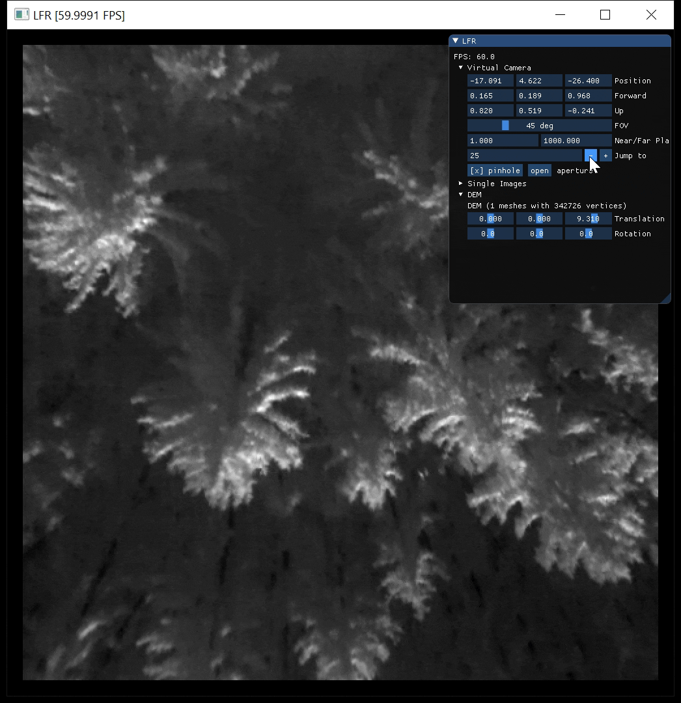

# AOS/LFR: A Light-Field Renderer for Airborne Optical Sectioning

This is a C++ implementation of the Light-Field Renderer for Airborne Optical Sectioning. 
It is based on OpenGL, uses [Dear ImGui](https://github.com/ocornut/imgui) and [WGLF](https://www.glfw.org/) for a basic user interface, and uses [Assimp](https://www.assimp.org/) to load a digital terrain.

## [Python bindings](/LFR/python/)
We provide Python bindings, which make it easy to use the renderer in Python projects. To compile them follow the steps described in [`/LFR/python/README`](./python/README.md).

## Install
To compile the renderer with the user interface in native C++ follow the steps below:
### Windows building: 
Open the Visual Studio solution at `/LFR/vs/LFR.sln` and compile it. Compilation has been tested with Visual Studio 2019 and the necessary libraries/DLLs (for Assimp and GLFW) are precompiled and included in the repository (`lib` and `bin`). 

### Linux (e.g. a Raspberry Pi) building: 
Install [GLFW](https://www.glfw.org/) and compile [Assimp](https://www.assimp.org/) first. 
Then run ...
XXX ToDo XXX

## Detailed usage

Please take a look at [`/LFR/src/main.cpp`](/LFR/src/main.cpp) for how to use the C++ code.

## Dependencies
Our software builds on the following code/libraries/tools from:
- [Dear ImGui](https://github.com/ocornut/imgui) for the user interface
- [GLFW](https://www.glfw.org/) for opengl window creation
- [Assimp](https://www.assimp.org/) for digital terrain loading
- [Glad](https://glad.dav1d.de/) for opengl loading
- [learnopengl.com](https://learnopengl.com/) for handling shaders and meshes
- [GLM](https://github.com/g-truc/glm) for matrix/vector calculations
- [nlohmann/json](https://github.com/nlohmann/json) for reading and writing JSON files
- [stb_image](https://github.com/nothings/stb) for reading images

## ToDos/Wishlist

Some of the features that will be nice to have or are on our agenda for implementation:

- [ ] support for masking / alpha channels (e.g., to remove FLIR watermark)
- [ ] render with RGB (3 channel) images. So far only grayscale has been tested.
- [ ] optionally display the satelite image on the ground
- [ ] show a wireframe of the digital elevation model
- [ ] check if float32 ifdef is working on the Raspberry Pi
- [ ] command line arguments: https://github.com/CLIUtils/CLI11#install 
- [ ] OBJ loading: switch to a more lightweight loader (e.g., https://github.com/tinyobjloader/tinyobjloader) or keep Assimp
- [ ] Image loading: stb_image does not support TIFF so consider switching to FreeImage, SDL, or OpenCV
- [ ] Unittests in C++: https://cmake.org/cmake/help/latest/module/CTest.html  
- [ ] Disable the OpenGL Window when using the python binding: https://www.glfw.org/docs/latest/context.html#context_offscreen or https://github.com/glfw/glfw/issues/648
- [ ] Optimize min/max computation (only used for displaying)

