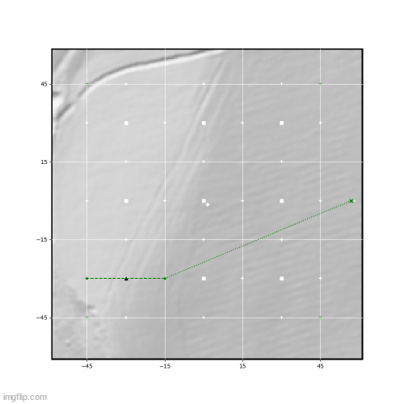

# AOS/PLAN: Planning Algorithm for Airborne Optical Sectioning

This is a Python implementation for path planning algorithm used with Airborne Optical Sensing. 



## Requirements

Make sure that the [required Python lybraries](../requirements.txt) are installed.

## Quick tutorial


```py
  import utm
  from Planner import Planner
  from PathVisualizer import Visualizer # for visualization on DEM image
  

  # path to the digital elevation model as required by the Visualizer
  dem_path = os.path.join( Path(__file__).parent.absolute(), '..',  'data', 'open_field', 'DEM' )
  vis = Visualizer( dem_path ) # initialize an instance of the visualizer (this is optional)

  # initialize the planning algorithm for a 90x90m area, where the grid cells are 30x30m large.
  p = Planner(  utm.from_latlon( 48.3356687, 14.3262629 ), (90,90), tile_distance=30 , debug=True, vis=vis, 
      conf_threshold=0.05) # only detections above this confidence score are resampled

  # plan the first points
  first_pts, record_flags = p.planpoints( ( 48.335673, 14.32703 ) )

  # ... do recording, processing, classifications 
  
  # person detections should be lists in a dict format such as
  detections = [{'gps':( 48.3356632, 14.3262612 ), 'conf': 0.3}]

  # update with position of AOS image and the detections 
  p.update( ct_pt, detections )

  # plan the next points
  next_pts, record_flags = p.planpoints( current_pos )
```

## More detailed usage

For a more detailed example look at the main program in `Planner.py`.

The digital elevation models are provided from the Upper Austrian government at https://www.land-oberoesterreich.gv.at/211780.htm and are converted with [GDAL](https://gdal.org/).

## References/License

