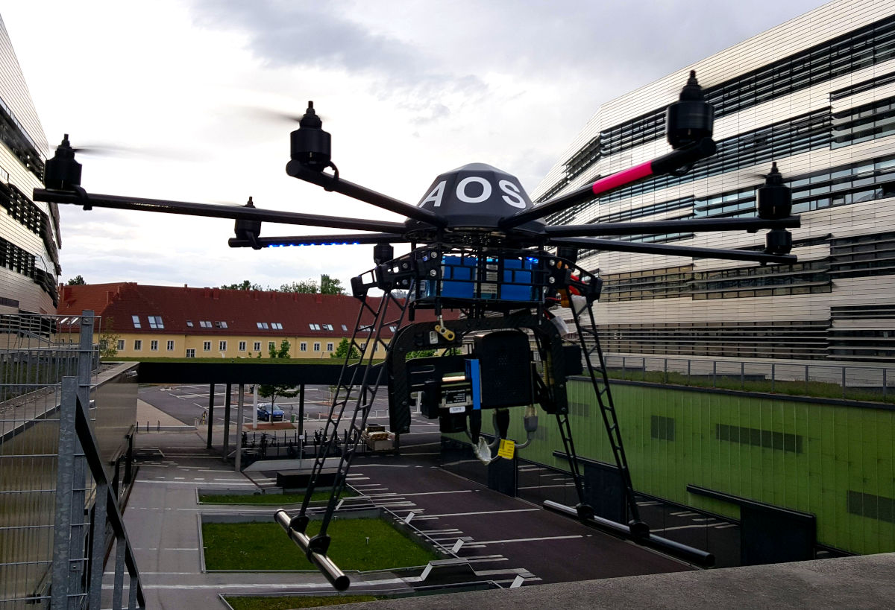
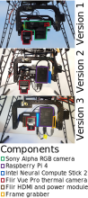

# AOS: Airborne Optical Sectioning for Search and Rescue in Forests

Airborne Optical Sectioning (AOS) is a wide synthetic-aperture imaging technique that employs manned or unmanned aircraft, to sample images within large (synthetic aperture) areas from above occluded volumes, such as forests. Based on the poses of the aircraft during capturing, these images are computationally combined to integral images by light-field technology. These integral images suppress strong occlusion and reveal targets that remain hidden in single recordings.

Single Images         |  Airborne Optical Sectioning
:-------------------------:|:-------------------------:
 | 

> Source: [Video on YouTube](https://www.youtube.com/watch?v=kyKVQYG-j7U) | [FLIR](https://www.flir.com/discover/cores-components/researchers-develop-search-and-rescue-technology-that-sees-through-forest-with-thermal-imaging/)
 

This repository contains software for drone-based search and rescue applications with airborne optical sectioning, as discussed in our [publications](#publications).

## News

## Publications

- Indrajit Kurmi, David C. Schedl, and Oliver Bimber, Combined People Classification with Airborne Optical Sectioning, IEEE SENSORS JOURNAL (under review), (2021)
- David C. Schedl, Indrajit Kurmi, and Oliver Bimber, Autonomous Drones for Search and Rescue in Forests, Science Robotics (accepted), (2021)
  - [arXiv (pre-print)](https://arxiv.org/pdf/2105.04328)  
  - [Data: ](https://doi.org/10.5281/zenodo.4349220) 
- David C. Schedl, Indrajit Kurmi, and Oliver Bimber, Search and rescue with airborne optical sectioning, Nature Machine Intelligence 2 (12), 783-790, https://doi.org/10.1038/s42256-020-00261-3 (2020)
  - [Nature (final version)](https://www.nature.com/articles/s42256-020-00261-3) | [(view only version)](https://rdcu.be/cbcf2) 
  - [arXiv (pre-print)](https://arxiv.org/pdf/2009.08835.pdf)
  - [Data: ](https://doi.org/10.5281/zenodo.3894773) 
  - [Video on YouTube](https://www.youtube.com/watch?v=kyKVQYG-j7U)
- Indrajit Kurmi, David C. Schedl, and Oliver Bimber, Pose Error Reduction for Focus Enhancement in Thermal Synthetic Aperture Visualization, IEEE Geoscience and Remote Sensing Letters, DOI: https://doi.org/10.1109/LGRS.2021.3051718 (2021).
  - [IEEE (final version)](https://ieeexplore.ieee.org/document/9340240) 
  - [arXiv (pre-print)](https://arxiv.org/abs/2012.08606)
- Indrajit Kurmi, David C. Schedl, and Oliver Bimber, Fast automatic visibility optimization for thermal synthetic aperture visualization, IEEE Geosci. Remote Sens. Lett. available at https://doi.org/10.1109/LGRS.2020.2987471 (2020).
  - [IEEE (final version)](https://ieeexplore.ieee.org/document/9086501) 
  - [arXiv (pre-print)](https://arxiv.org/abs/2005.04065)
  - [Video on YouTube](https://www.youtube.com/watch?v=39GU1BOCfWQ&ab_channel=JKUInstituteofComputerGraphics)
- David C. Schedl, Indrajit Kurmi, and Oliver Bimber, Airborne Optical Sectioning for Nesting Observation. Sci Rep 10, 7254, https://doi.org/10.1038/s41598-020-63317-9 (2020).
  - [Nature (open access and final version)](https://www.nature.com/articles/s41598-020-63317-9) 
  - [Video on YouTube](www.youtube.com/watch?v=81l-Y6rVznI)
- Indrajit Kurmi, David C. Schedl, and Oliver Bimber, Thermal airborne optical sectioning. Remote Sensing. 11, 1668, DOI: 10.3390/rs11141668, (2019).
  - [MDPI (open access and final version)](https://www.mdpi.com/2072-4292/11/14/1668) 
  - [Video on YouTube](https://www.youtube.com/watch?v=_t2GEwA_tus&ab_channel=JKUCG)
- Indrajit Kurmi, David C. Schedl, and Oliver Bimber, A statistical view on synthetic aperture imaging for occlusion removal. IEEE Sensors J. 19, 9374 – 9383 (2019).
  - [IEEE (final version)](https://ieeexplore.ieee.org/document/8736348)
  - [arXiv (pre-print)](https://arxiv.org/abs/1906.06600) 
- Oliver Bimber, Indrajit Kurmi, and David C. Schedl, Synthetic aperture imaging with drones. IEEE Computer Graphics and Applications. 39, 8 – 15 (2019).
  - [IEEE (open access and final version)](https://doi.ieeecomputersociety.org/10.1109/MCG.2019.2896024) 
- Indrajit Kurmi, David C. Schedl, and Oliver Bimber, Airborne optical sectioning. Journal of Imaging. 4, 102 (2018).
  - [MDPI (open access and final version)](https://www.mdpi.com/2313-433X/4/8/102)
  - [Video on YouTube](https://www.youtube.com/watch?v=ELnvBfafnRA&ab_channel=JKUCG) 

## Modules

- [LFR](LFR/README.md)      (C++ and Python code): computes integral images.
- [DET](DET/README.md)      (Python code): contains the person classification.
- [CAM](CAM/README.md)      (Python code): the module for triggering, recording, and processing thermal images.
- [PLAN](PLAN/README.md)    (Python code): implementation of our path planning and adaptive sampling technique.
- [DRONE](DRONE/README.md)  (C and Python code): contains the implementation for drone communication and the logic to perform AOS flights. 

Note that the modules LFR, DET, CAM, PLAN are standalone software packages that can installed and used independently. The DRONE module, however, relies on the other modules (LFR, DET, CAM, PLAN) in this repository.

## Installation

To install the individual modules, refer to the [module's README](#modules).
For the Python modules (DET, CAM, PLAN) it is sufficient to verify that the [required Python libraries](../requirements.txt) are available. Furthermore, the classifier (DET) relies on the [OpenVINO toolkit](https://docs.openvinotoolkit.org/latest/index.html). 
The modules containing C/C++ code (LFR, DRONE) need to be compiled before they can be used. 
All other modules (LFR, DET, CAM, PLAN) have to be installed before the DRONE module can be used.

## Hardware

For our prototype, an octocopter (MikroKopter OktoXL 6S12, two LiPo 4500mAh batteries, 4.5kg to 4.9kg;) carries our payload. In the course of the project 3 versions of payloads with varying components have been used.

Prototype        |  Payload
:-------------------------:|:-------------------------:
 | 

### Payload Version 1
Initially, the drone was equipped with a thermal camera (FlirVue Pro; 9mm fixed focal length lens; 7.5μm to 13.5μm spectral band; 14 bit non-radiometric) and an RGB camera (Sony Alpha 6000; 16mm to 50mm lens at infinite focus).
The cameras were fixed to a rotatable gimbal, were triggered synchronously (synched by a MikroKopter CamCtrl controlboard), and pointed downwards during all flights. 
The flight was planned using MikroKopter's flight planning software and uploaded to the drone as waypoints. 
The waypoint protocol triggered the cameras every 1m along the flight path, and the recorded images were stored on the cameras’ internal memory cards. Processing was done offline after landing the drone.

### Payload Version 2
For the second iteration, the RGB camera was removed. 
Instead we mounted a single-board  system-on-chip computer (SoCC) (RaspberryPi 4B; 5.6 cm × 8.6 cm; 65 g; 8 GB ram), an LTE communication hat (Sixfab 3G/4G & LTE base hat and a SIM card; 5.7 cm × 6.5 cm; 35 g), and a Vision Processing Unit (VPU) (Intel Neural Compute Stick 2; 7.2 cm × 2.7 cm × 1.4 cm; 30 g). The equipments weighted 320g and was mounted on the rotatable gimbal. 
In comparison to Version 1, this setup allows full processing on the drone (including path planning and triggering the camera).

### Payload Version 3
The third version additionally mounts a Flir power module providing HDMI video output from the camera (640x480 @30Hz; 15g), and a video capture card (totaling 350g).
In comparison to Version 2, this setup allows faster thermal recordings and thus faster flying speeds.
The [CAM module](CAM/README.md) supports Version 3 of our Payload.

## License
* Data: Creative Commons Attribution 4.0 International
* Code: You are free to modify and use our software non-commercially; Commercial usage is restricted (see the [LICENSE.txt](LICENSE.txt))

## Todo
* [ ] rework READMEs
* [ ] LFR/Makefile
* [ ] Drone/Makefile
* [ ] add videos/gifs
* [ ] merge restruct into main branch and remove other branches
