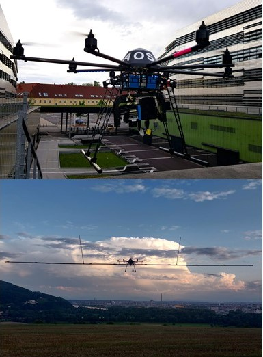
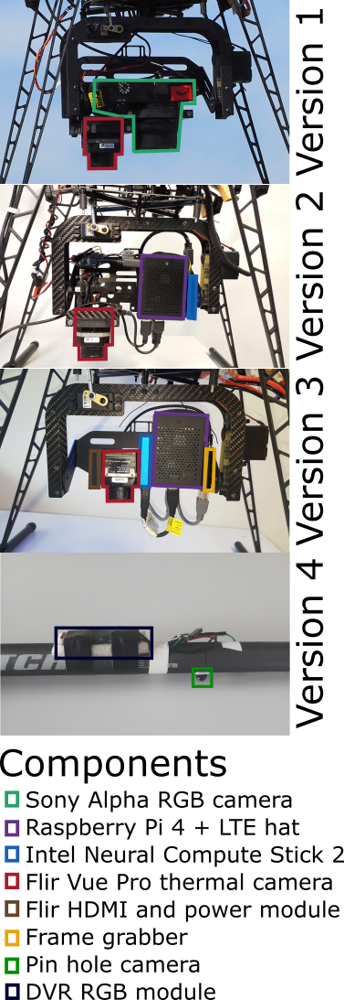

# AOS: Airborne Optical Sectioning

Airborne Optical Sectioning (AOS) is a wide synthetic-aperture imaging technique that employs manned or unmanned aircraft, to sample images within large (synthetic aperture) areas from above occluded volumes, such as forests. Based on the poses of the aircraft during capturing, these images are computationally combined to integral images by light-field technology. These integral images suppress strong occlusion and reveal targets that remain hidden in single recordings.

Single Images         |  Airborne Optical Sectioning
:-------------------------:|:-------------------------:
 | 

> Source: [Video on YouTube](https://www.youtube.com/watch?v=kyKVQYG-j7U) | [FLIR](https://www.flir.com/discover/cores-components/researchers-develop-search-and-rescue-technology-that-sees-through-forest-with-thermal-imaging/)
 

This repository contains [software modules](#modules) for drone-based search and rescue applications with airborne optical sectioning, as discussed in our [publications](#publications). It is made available under a [dual licence model](#license).

## Contacts
Univ.-Prof. Dr. Ing. habil. Oliver Bimber
 
 Johannes Kepler University Linz
 Institute of Computer Graphics
 Altenberger Straße 69
 Computer Science Building
 3rd Floor, Room 0302
 4040 Linz, Austria 
 
 Phone: +43-732-2468-6631 (secretary: -6630)
 Web: www.jku.at/cg 
 Email: oliver.bimber@jku.at

## Sponsors
- Austrian Science Fund (FWF)
- State of Upper Austria, Nationalstiftung für Forschung, Technologie und Entwicklung
- Linz Institute of Technology (LIT) 

## News (see also [Press](https://www.jku.at/en/institute-of-computer-graphics/press-events/press))

- 11/29/2021: Our recent work, **Acceleration-Aware Path Planning with Waypoints** has been published. See [publications](#publications) (Acceleration-Aware Path Planning with Waypoints)
- 11/15/2021: New work on **Through-Foliage Tracking with AOS**. See [publications](#publications) (Through-Foliage Tracking with Airborne Optical Sectioning)  
- 06/23/2021: **Science Robotics** paper appeared. See [publications](#publications) (Autonomous Drones for Search and Rescue in Forests)  
- 5/31/2021: **New combined people classifer** outbeats classical people classifers significantly. See [publications](#publications) (Combined People Classification with Airborne Optical Sectioning) 
- 04/15/2021: First AOS experiments with **DJI M300RTK** reveals remarkable results (much better than with our OktoXL 6S12, due to higher GPS precission and better IR camera/stabilizer). 

## Publications
- Rudolf Ortner, Indrajit Kurmi, and Oliver Bimber, Acceleration-Aware Path Planning with Waypoints. Drones. 5, no. 4: 143 (2021).
  - [Drones (open access and Online version)](https://www.mdpi.com/2504-446X/5/4/143)
  - [Path Planner (Code)](https://github.com/rudolfortner/aapp)
- Rakesh John Amala Arokia Nathan, Indrajit Kurmi, David C. Schedl and Oliver Bimber, Through-Foliage Tracking with Airborne Optical Sectioning, Remote Sensing of Environment (under Review), (2021)
  - [arXiv (pre-print)](https://arxiv.org/abs/2111.06959) 
  - [Data: ](https://doi.org/10.5281/zenodo.5680949)
  - [Video on YouTube (two persons tracked)](https://www.youtube.com/watch?v=RdrYUOEoxHM)
  - [Video on YouTube (one person tracked)](https://www.youtube.com/watch?v=pzdKJtyNxcM)
- Indrajit Kurmi, David C. Schedl, and Oliver Bimber, Combined People Classification with Airborne Optical Sectioning, Nature Scientific Reports, 12, Article number: 3804, 2022
  - [Nature Scientific Reports (final version)](https://www.nature.com/articles/s41598-022-07733-z)
  - [arXiv (pre-print)](https://arxiv.org/abs/2106.10077)  
  - [Data: ](https://doi.org/10.5281/zenodo.5013640)
- David C. Schedl, Indrajit Kurmi, and Oliver Bimber, Autonomous Drones for Search and Rescue in Forests, Science Robotics 6(55), eabg1188, https://doi.org/10.1126/scirobotics.abg1188, (2021)
  - [Science (final version)](https://doi.org/10.1126/scirobotics.abg1188)
  - [arXiv (pre-print)](https://arxiv.org/pdf/2105.04328)  
  - [Data: ](https://doi.org/10.5281/zenodo.4349220) 
  - [Video on YouTube](https://www.youtube.com/watch?v=ebk7GQH5ltk)
- David C. Schedl, Indrajit Kurmi, and Oliver Bimber, Search and rescue with airborne optical sectioning, Nature Machine Intelligence 2, 783-790, https://doi.org/10.1038/s42256-020-00261-3 (2020)
  - [Nature (final version)](https://www.nature.com/articles/s42256-020-00261-3) | [(view only version)](https://rdcu.be/cbcf2) 
  - [arXiv (pre-print)](https://arxiv.org/pdf/2009.08835.pdf)
  - [Data: ](https://doi.org/10.5281/zenodo.3894773) 
  - [Video on YouTube](https://www.youtube.com/watch?v=kyKVQYG-j7U)
- Indrajit Kurmi, David C. Schedl, and Oliver Bimber, Pose Error Reduction for Focus Enhancement in Thermal Synthetic Aperture Visualization, IEEE Geoscience and Remote Sensing Letters, DOI: https://doi.org/10.1109/LGRS.2021.3051718 (2021).
  - [IEEE (final version)](https://ieeexplore.ieee.org/document/9340240) 
  - [arXiv (pre-print)](https://arxiv.org/abs/2012.08606)
- Indrajit Kurmi, David C. Schedl, and Oliver Bimber, Fast automatic visibility optimization for thermal synthetic aperture visualization, IEEE Geosci. Remote Sens. Lett. https://doi.org/10.1109/LGRS.2020.2987471 (2020).
  - [IEEE (final version)](https://ieeexplore.ieee.org/document/9086501) 
  - [arXiv (pre-print)](https://arxiv.org/abs/2005.04065)
  - [Video on YouTube](https://www.youtube.com/watch?v=39GU1BOCfWQ&ab_channel=JKUInstituteofComputerGraphics)
- David C. Schedl, Indrajit Kurmi, and Oliver Bimber, Airborne Optical Sectioning for Nesting Observation. Sci Rep 10, 7254, https://doi.org/10.1038/s41598-020-63317-9 (2020).
  - [Nature (open access and final version)](https://www.nature.com/articles/s41598-020-63317-9) 
  - [Video on YouTube](https://www.youtube.com/watch?v=81l-Y6rVznI)
- Indrajit Kurmi, David C. Schedl, and Oliver Bimber, Thermal airborne optical sectioning. Remote Sensing. 11, 1668, https://doi.org/10.3390/rs11141668, (2019).
  - [MDPI (open access and final version)](https://www.mdpi.com/2072-4292/11/14/1668) 
  - [Video on YouTube](https://www.youtube.com/watch?v=_t2GEwA_tus&ab_channel=JKUCG)
- Indrajit Kurmi, David C. Schedl, and Oliver Bimber, A statistical view on synthetic aperture imaging for occlusion removal. IEEE Sensors J. 19, 9374 – 9383 (2019).
  - [IEEE (final version)](https://ieeexplore.ieee.org/document/8736348)
  - [arXiv (pre-print)](https://arxiv.org/abs/1906.06600) 
- Oliver Bimber, Indrajit Kurmi, and David C. Schedl, Synthetic aperture imaging with drones. IEEE Computer Graphics and Applications. 39, 8 – 15 (2019).
  - [IEEE (open access and final version)](https://doi.ieeecomputersociety.org/10.1109/MCG.2019.2896024) 
- Indrajit Kurmi, David C. Schedl, and Oliver Bimber, Airborne optical sectioning. Journal of Imaging. 4, 102 (2018).
  - [MDPI (open access and final version)](https://www.mdpi.com/2313-433X/4/8/102)
  - [Video on YouTube](https://www.youtube.com/watch?v=ELnvBfafnRA&ab_channel=JKUCG) 

## Modules

- [LFR](LFR/README.md)      (C++ and Python code): computes integral images.
- [DET](DET/README.md)      (Python code): contains the person classification.
- [CAM](CAM/README.md)      (Python code): the module for triggering, recording, and processing thermal images.
- [PLAN](PLAN/README.md)    (Python code): implementation of our path planning and adaptive sampling technique.
- [DRONE](DRONE/README.md)  (C and Python code): contains the implementation for drone communication and the logic to perform AOS flights.
- [SERV](SERV/README.md)  (Rust code): contains the implementation of a dabase server to which AOS flights data are uploaded.

Note that the modules LFR, DET, CAM, PLAN, SERV are standalone software packages that can be installed and used independently. The DRONE module, however, relies on the other modules (LFR, DET, CAM, PLAN, SERV) in this repository.

## Installation

To install the individual modules, refer to the [module's README](#modules).
For the Python modules (DET, CAM, PLAN) it is sufficient to verify that the [required Python libraries](../requirements.txt) are available. Furthermore, the classifier (DET) relies on the [OpenVINO toolkit](https://docs.openvinotoolkit.org/latest/index.html). 
The modules containing C/C++ code (LFR, DRONE) need to be compiled before they can be used. 
Similarily the module containing Rust code (SERV) need to be compiled before it can be used.
All other modules (LFR, DET, CAM, PLAN, SERV) have to be installed before the DRONE module can be used.

## Hardware

For our prototype, an octocopter (MikroKopter OktoXL 6S12, two LiPo 4500 mAh batteries, 4.5 kg to 4.9 kg) carries our payload. In the course of the project 4 versions of payloads with varying components have been used.

Prototype        |  Payload
:-------------------------:|:-------------------------:
 | 

### Payload Version 1
Initially, the drone was equipped with a thermal camera (FlirVue Pro; 9 mm fixed focal length lens; 7.5 μm to 13.5 μm spectral band; 14 bit non-radiometric) and an RGB camera (Sony Alpha 6000; 16 mm to 50 mm lens at infinite focus).
The cameras were fixed to a rotatable gimbal, were triggered synchronously (synched by a MikroKopter CamCtrl controlboard), and pointed downwards during all flights. 
The flight was planned using MikroKopter's flight planning software and uploaded to the drone as waypoints. 
The waypoint protocol triggered the cameras every 1m along the flight path, and the recorded images were stored on the cameras’ internal memory cards. Processing was done offline after landing the drone.

### Payload Version 2
For the second iteration, the RGB camera was removed. 
Instead we mounted a single-board  system-on-chip computer (SoCC) (RaspberryPi 4B; 5.6 cm × 8.6 cm; 65 g; 8 GB ram), an LTE communication hat (Sixfab 3G/4G & LTE base hat and a SIM card; 5.7 cm × 6.5 cm; 35 g), and a Vision Processing Unit (VPU) (Intel Neural Compute Stick 2; 7.2 cm × 2.7 cm × 1.4 cm; 30 g). The equipments weighted 320 g and was mounted on the rotatable gimbal. 
In comparison to Version 1, this setup allows full processing on the drone (including path planning and triggering the camera).

### Payload Version 3
The third version additionally mounts a Flir power module providing HDMI video output from the camera (640x480, 30 Hz; 15 g), and a video capture card (totaling 350g).
In comparison to Version 2, this setup allows faster thermal recordings and thus faster flying speeds.
This repository is using Version 3 of our Payload right now.

### Payload Version 4
The fourth version does not include any payloads from the previous versions. Instead the payload consists of a custom built light-weight camera array based on a truss design. It carries ten light weight DVR pin-hole cameras (12g each), attached equidistant (1m) to each other on a 9m long detachable and hollow carbon fibre tube (700g) which is segmented into detachable sections (one of the sections is shown in the image) of varying lengths and a gradual reduction in diameter in each section from 2.5cm at the drone centre to 1.5cm at the outermost section.The cameras are aligned in such a way that their optical axes are parallel and pointing downwards. They record images at a resolution of 1600X1200 pixels and videos at a resolution of 1280X720 and 30fps to individual SD cards. All cameras receive power from two central 7.2V Ni-MH batteries and are synchronously triggered from the drone's flight controller trough a flat-band cable bus.

## Data

We provide exemplary datasets in the [`data/open_field`](data/open_field), and [`LFR/data/F0`](LFR/data/F0) folders.
The digital elevation models in the `DEM`subfolders, are provided by the Upper Austrian government, and are converted to meshes and hillshaded images with GDAL. 
The `images` and `poses` are in the corresponding folders.
The `F0` was recorded while flying over forest with the payload version 1 and is [available online](https://doi.org/10.5281/zenodo.3894773).
The open field dataset is a linear flight without high vegetation and was recorded with payload version 3 in the course of the experimnents for the "Combined People Classification with Airborne Optical Sectioning" article.

## Simulation

A [simulator](https://aos.tensorware.app) for forest occlusion has been developed by Fracis Seits. The code is available [here](https://github.com/tensorware/aos-simulation).

## Acceleration-Aware Path Planner

A path planner which takes acceleration/deceleration into consideration while planning waypoints has been developed by Mr. Rudolf Ortner. The code is available [here](https://github.com/rudolfortner/aapp).

## License
* Data: Creative Commons Attribution 4.0 International
* Code Modules: You are free to modify and use our software non-commercially; Commercial usage is restricted (see the [LICENSE.txt](LICENSE.txt))
* Occlusion Simulator: [MIT](https://github.com/tensorware/aos-simulation/blob/master/LICENSE) 
* OpenGL Support libraries [`LFR/include/learnopengl/camera.h`](LFR/include/learnopengl/camera.h), [`LFR/include/learnopengl/mesh.h`](LFR/include/learnopengl/mesh.h), [`LFR/include/learnopengl/model.h`](LFR/include/learnopengl/model.h) and [`LFR/include/learnopengl/shader.h`](LFR/include/learnopengl/shader.h) : [CC BY-NC 4.0](https://github.com/JoeyDeVries/LearnOpenGL/blob/master/LICENSE.md)
