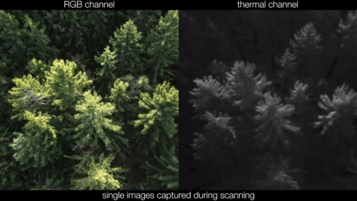
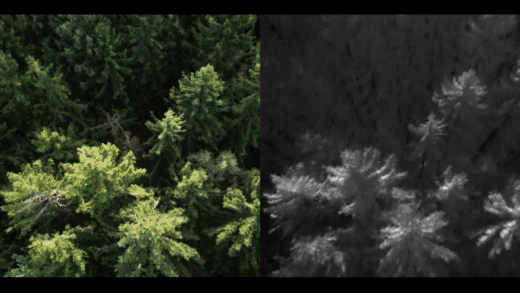

# AOS: Airborne Optical Sectioning

Airborne Optical Sectioning (AOS) is a wide synthetic-aperture imaging technique that employs manned or unmanned aircraft, to sample images within large (synthetic aperture) areas from above occluded volumes, such as forests. Based on the poses of the aircraft during capturing, these images are computationally combined to integral images by light-field technology. These integral images suppress strong occlusion and reveal targets that remain hidden in single recordings.

Single Images         |  Airborne Optical Sectioning
:-------------------------:|:-------------------------:
 | 

> Source: [Video on YouTube](https://www.youtube.com/watch?v=9HLdiJAZNTM) | [FLIR](https://www.flir.com/discover/cores-components/researchers-develop-search-and-rescue-technology-that-sees-through-forest-with-thermal-imaging/)
 

This repository contains software modules for drone-based search and rescue applications with airborne optical sectioning, as discussed in our [publications](#publications). They are made available under a [dual licence model](#license).

Please refer to:

- **[AOS Data](https://github.com/JKU-ICG/AOS/tree/stable_release/AOS%20Data)**: Summarized sources of simulated an real AOS data. 
- **[AOS Simulation](https://github.com/JKU-ICG/AOS/tree/stable_release/AOS%20Simulation)**: Several options for simulating AOS and pre-computed simulated training data. 
- **[AOS for DJI](https://github.com/JKU-ICG/AOS/tree/stable_release/AOS%20for%20DJI)**: Our DJI compatible AOS app.
- **[AOS for Drone Swarms](https://github.com/JKU-ICG/AOS/tree/stable_release/AOS%20for%20Drone%20Swarms)**: Our basic research on applying AOS to drone swarms.
- **[AOS for Own Projects](https://github.com/JKU-ICG/AOS/tree/stable_release/AOS%20for%20Own%20Projects)**: Source code supporting your own AOS projects.
- **[AOS Groundstation](https://github.com/JKU-ICG/AOS/tree/stable_release/AOS%20Groundstation)**: Software to operate single or multiple drones from a PC.

This research is supported by variaty of [sponsors](#sponsors). See [news](#news) for latest updates.

## Contacts
Univ.-Prof. Dr. Ing. habil. Oliver Bimber
 
 Johannes Kepler University Linz
 Institute of Computer Graphics
 Altenberger Straße 69
 Computer Science Building
 3rd Floor, Room 0302
 4040 Linz, Austria 
 
 Phone: +43-732-2468-6631 (secretary: -6630)
 Web: www.jku.at/cg 
 Email: oliver.bimber@jku.at

## Sponsors and Collaborators
- Austrian Science Funds (FWF)
- German Science Funds (DFG)
- State of Upper Austria (OÖ)
- Nationalstiftung für Forschung, Technologie und Entwicklung (FTE)
- Linz Institute of Technology (LIT)
- German Aerospace Center (DLR)
- Upper Austrian Fire Brigade Association (OÖLFV)
- Federal Office of Metrology and Surveying (BEV)
- University of Cambridge (CAM)
- Helmholtz-Centre for Environmental Research (UFZ)
- Austrian Hail Insurance (HV)

## News (see also [Press](https://www.jku.at/en/institute-of-computer-graphics/press-events/press))
- 11/27/2025: **[Behind-the-paper story](https://communities.springernature.com/posts/the-forest-is-no-longer-a-hiding-place-how-an-intelligent-drone-swarm-sees-through-the-canopy)** of new Nature Com. Eng. article on our AOS drone swarm.
- 8/30/2025: **DeepForrest Paper accepted for publication in Science PJ on Remote Sensing**: See [publications](#publications) 
- 5/12/2025: **JKU and DLR support German police**: ...in searching for a tripple murderer. See [press release](https://www.jku.at/news-events/news/detail/news/jku-und-dlr-unterstuetzten-deutsche-polizei-bei-suche-nach-mordverdaechtigem/)  
- 3/19/2025: **AOS with fixed-wing drones**: first succesful experiments with data recorded on [Quantum Systems' Vector](https://quantum-systems.com/vector/) and [DLR's MACS-Nano aerial camera system](https://www.dlr.de/de/os/ueber-uns/abteilungen/sicherheitsforschung-und-anwendung/macs-modular-camera-systems) with focus on wild-fire detection.
- 2/5/2025: **AOS for Forest Ecology**: See [publications](#publications)
- 09/27/2024: **Stereoscopic Depth Perception Through Foliage** accepted for publication in Nature Scientific Reports.
- 7/20/2024: **AOS Groundstation for controlling single and multiple drones available**: See [Source Code](https://github.com/JKU-ICG/AOS/tree/stable_release/AOS%20Groundstation)
- 7/09/2024: **AOS featured in Scientific American**: See [Article](https://www.scientificamerican.com/article/how-drones-are-revolutionizing-search-and-rescue/)
- 6/21/2024: **All Field-Experiments with our Drone Swarm**: See [Video Playlist](https://www.youtube.com/playlist?list=PLgGsWgs4hgaMXzo7QhSwNRctz9JTvh1JM) and [AOS for Swarms](https://github.com/JKU-ICG/AOS/tree/stable_release/AOS%20for%20Drone%20Swarms)
- 4/29/2024: **First Field-Experiment with Drone Swarm**: See [AOS for Swarms](https://github.com/JKU-ICG/AOS/tree/stable_release/AOS%20for%20Drone%20Swarms) and  [Air-to-Air Video Recording](https://www.youtube.com/watch?v=uiMJt6otmSQ) 
- 4/8/2024: **AOS data sources summarized**: See [AOS Data](https://github.com/JKU-ICG/AOS/blob/stable_release/AOS%20Data)
- 3/19/2024: **Waypoint planning for swarms**: See [AOS for Swarms](https://github.com/JKU-ICG/AOS/tree/stable_release/AOS%20for%20Drone%20Swarms)
- 3/8/2024: **AOS on TV**: [Marys Magazin (ORF2, ARD Aplha)](https://www.ardmediathek.de/video/mayrs-magazin-wissen-fuer-alle/mayrs-magazin-wissen-fuer-alle/ard-alpha/Y3JpZDovL2JyLmRlL3ZpZGVvLzA0YWE3ZDM0LTQzYzUtNDk3MS1hNjE4LTZjOGM5MDE3NmRkNA).
- 2/29/2024: **Simulated AOS training data made available**: See [AOS Simulation](https://github.com/JKU-ICG/AOS/blob/stable_release/AOS%20Simulation)
- 2/14/2024: **New image fusion approach presented (with first results on wildfire monitoring)**: See [publications](#publications)
- 1/19/2024: **Real-time map visualization of swarms**: See [AOS for Swarms](https://github.com/JKU-ICG/AOS/tree/stable_release/AOS%20for%20Drone%20Swarms)
- 12/25/2023: **DL-based fusion of multispectral integral and single images**: See [publications](#publications)
- 11/9/2023: **Stereoscopic AOS**: First-person-view (FPV) stereoscopic AOS visualization supported for [DJI](https://github.com/JKU-ICG/AOS/tree/stable_release/AOS%20for%20DJI) (via stereoscopic HMDs attached to the remote controls).
- 10/24/2023: **New findings on stereoscopic depth perception through foliage**: See [publications](#publications)
- 10/31/2023: **New research project AOSonFire** started (early wildfire detection using AOS). Together with Upper Austrian Fire Brigade Headquarters. 
- 09/05/2023: **Synthetic Aperture Anomaly Imaging** published in J. Remote Sensing. See [publications](#publications)
- 08/3/2023: **[Behind-the-paper story](https://compscicommunity.springernature.com/posts/seeing-through-forest-with-drone-swarms)** of new Nature Com. Eng. article on AOS drone swarm strategies.
- 06/01/2023: **Additional research grants** for AOSonFire: Airborne Optical Sectioning for Early Wildfire Detection. In collaboration with Upper Austrian Fire Brigade Headquarters.
- 05/25/2023: **Nature Communications Engineering** paper accepted. See [publications](#publications) (Synthetic Aperture Sensing for Occlusion Removal with Drone Swarms)  
- 04/24/2023: **AOS covered in April issues of [Drones Magazin](https://www.drones-magazin.de/) and [Drohnen Magazin](http://www.drohnenmagazin.com/)**
- 03/29/2023: **AOS at [AERO Drones](https://www.aero-expo.de/themen-programm/aero-branchen/drohnen).** See AOS at AERODrones, Hall A2, Booth 113.
- 03/01/2023: **New Weave (FWF&DFG) funded basic research project** on AOS for moving targets granted. In collaboration with German Aerospace Center (DLR) and Otto-von-Guericke University Magdeburg.
- 02/08/2023: **DJI SDK 5 support (Mavic 3T, etc.) and new app with real-time anomaly detection.** See [AOS for DJI](https://github.com/JKU-ICG/AOS/tree/stable_release/AOS%20for%20DJI)
- 12/30/2022: **First AOS approach towards drone swarms** for autonomous and adaptive sampling. See [publications](#publications) (Synthetic Aperture Sensing for Occlusion Removal with Drone Swarms)
- 11/29/2022: **Study on state-of-the-art color anomaly detectors** suitable for through-foliage detection and tracking. See [publications](#publications) (Evaluation of Color Anomaly Detection in Multispectral Images For Synthetic Aperture Sensing)
- 07/28/2022: **Inverse Airborne Optical Sectioning** -- through-foilage tracking with a single, conventional, hovering (stationary) drone. See [publications](#publications) (Inverse Airborne Optical Sectioning)  
- 06/13/2022: **DJI Enterprise Systems with Thermal Imaging supported** See [AOS for DJI](https://github.com/JKU-ICG/AOS/tree/stable_release/AOS%20for%20DJI)
- 04/25/2022: **Through-Foliage Tracking with Airborne Optical Sectioning** pubisled in Science Partner Journal of Remote Sensing. See [publications](#publications) (Through-Foliage Tracking with Airborne Optical Sectioning) 
- 03/22/2022: **AOS for DJI released** See [AOS for DJI](https://github.com/JKU-ICG/AOS/tree/stable_release/AOS%20for%20DJI)
- 03/09/2022: **Combined Person Classification with Airborne Optical Sectioning** published in Nature Scientific Reports
- 11/29/2021: Our recent work, **Acceleration-Aware Path Planning with Waypoints** has been published. See [publications](#publications) (Acceleration-Aware Path Planning with Waypoints)
- 06/23/2021: **Science Robotics** paper appeared. See [publications](#publications) (Autonomous Drones for Search and Rescue in Forests)  
- 5/31/2021: **New combined people classifer** outbeats classical people classifers significantly. See [publications](#publications) (Combined People Classification with Airborne Optical Sectioning) 
- 04/15/2021: First AOS experiments with **DJI M300RTK** reveals remarkable results (much better than with our OktoXL 6S12, due to higher GPS precission and better IR camera/stabilizer). 

## Publications
- Mohamed Youssef, Lukas Brunner, Klaus Rundhammer, Gerald Czech, and Oliver Bimber, Through-Foliage Surface-Temperature Reconstruction for early Wildfire Detection, under review (2025)
  - [arXiv (pre-print)](https://arxiv.org/abs/2511.12572)
  - [Data:]( https://zenodo.org/records/17476499)
- Mohamed Youssef, Jian Peng, and Oliver Bimber, DeepForest: Sensing Into Self-Occluding Volumes of Vegetation 
With Aerial Imaging, Science PJ Remote Sensing (2025)
  - [Journal of Remote Sensing (open access and final version)](https://spj.science.org/doi/10.34133/remotesensing.0907)
  - [arXiv (pre-print)](https://arxiv.org/abs/2502.02171v1)
  - [Supplementary Videos](https://www.youtube.com/playlist?list=PLgGsWgs4hgaOlbi7J5Zn9YpqDLSeXmqBZ)
  - [Data: ](https://doi.org/10.5281/zenodo.14748447)
- Rakesh John Amala Arokia Nathan, Sigrid Strand, Daniel, Mehrwald, Dmitriy Shutin, Oliver Bimber, An Autonomous Drone Swarm for Detecting and Tracking Anomalies among Dense Vegetation, under revision (2025)
  - [Nature Com. Eng. (open access and final version)](https://www.nature.com/articles/s44172-025-00546-8)
  - [arXiv (pre-print)](https://arxiv.org/abs/2407.10754)
  - [Video Abstract](https://www.youtube.com/playlist?list=PLgGsWgs4hgaMXzo7QhSwNRctz9JTvh1JM)
  - [Data: ](https://doi.org/10.5281/zenodo.12720784)
- Rakesh John Amala Arokia Nathan, Sigrid Strand, Dmitriy Shutin, Oliver Bimber, Reciprocal Visibility for Guided Occlusion Removal With Drones, IEEE Geosci. Remote Sens. Lett. 21, 1 – 5 (2024).
  - [IEEE (open access and online version)](https://ieeexplore.ieee.org/document/10659026)
  - [arXiv (pre-print)](https://arxiv.org/abs/2402.06991)
- Mohamed Youssef and Oliver Bimber, Fusion of Single and Integral Multispectral Aerial Images, Remote Sens., 16(4), 673, (2024)
  - [Remote Sensing (open access and online version)](https://www.mdpi.com/2072-4292/16/4/673)
  - [PDF Version (open access)](https://www.mdpi.com/2072-4292/16/4/673/pdf) 
  - [arXiv (pre-print)](https://arxiv.org/abs/2311.17515)
  - [Data and Code: ](https://zenodo.org/records/10210035)
- Robert Kerschner, Rakesh John Amala Arokia Nathan, Rafal Mantiuk, Oliver Bimber, Stereoscopic Depth Perception Through Foliage, Nature Scientific Reports 14, 23056 (2024).
  - [Nat Sci. Rep. (open access and online version)]( https://doi.org/10.1038/s41598-024-74666-0) 
  - [arXiv](https://arxiv.org/abs/2310.16120)
  - [Data: ](https://zenodo.org/records/8423145)
- Julia Pöschl, Adaptive Particle Swarm Optimization for through-foliage target detection with drone swarms (2023)
  - [arXiv](http://arxiv.org/abs/2310.10320) 
- Rakesh John Amala Arokia Nathan and Oliver Bimber, Synthetic Aperture Anomaly Imaging for Through-Foliage Target Detection, Remote Sensing, Volume 15, Number 18, (2023)
  - [Remote Sensing (open access and online version)](https://www.mdpi.com/2072-4292/15/18/4369)
  - [PDF Version (open access)](https://www.mdpi.com/2072-4292/15/18/4369/pdf) 
  - [arXiv (pre-print)](https://arxiv.org/abs/2304.13590) 
  - [Data: ](https://doi.org/10.5281/zenodo.7867080)
- Rakesh John Amala Arokia Nathan, Indrajit Kurmi and Oliver Bimber, Drone swarm strategy for the detection and tracking of occluded targets in complex environments, Nature Communications Engineering 2, 55, https://doi.org/10.1038/s44172-023-00104-0, (2023)
  - [Nature Com. Eng. (final open access and online version)](https://www.nature.com/articles/s44172-023-00104-0)
  - [Nature Com. Eng. (final open access and PDF version)](https://www.nature.com/articles/s44172-023-00104-0.pdf) 
  - [arXiv (pre-print)](https://arxiv.org/abs/2212.14692) 
  - [Data: ](https://doi.org/10.5281/zenodo.7472380)
  - [Code](https://github.com/JKU-ICG/AOS/tree/stable_release/AOS%20for%20Drone%20Swarms)
  - [Video Abstract](https://www.youtube.com/watch?v=nb0K7n03qFU)
- Francis Seits, Indrajit Kurmi, and Oliver Bimber, Evaluation of Color Anomaly Detection in Multispectral Images For Synthetic Aperture Sensing, Eng, 3(4), 541-553, (2022)
  - [Eng (open access and online version)](https://www.mdpi.com/2673-4117/3/4/38) 
  - [PDF Version (open access)]( https://www.mdpi.com/2673-4117/3/4/38/pdf) 
  - [arXiv (pre-print)](https://arxiv.org/abs/2211.04293) 
- Rakesh John Amala Arokia Nathan, Indrajit Kurmi and Oliver Bimber, Inverse Airborne Optical Sectioning, Drones, Volume 6, Number 9, (2022)
  - [Drones (open access and online version)](https://www.mdpi.com/2504-446X/6/9/231)
  - [arXiv (pre-print)](https://arxiv.org/abs/2207.13344) 
  - [Data: ](https://doi.org/10.5281/zenodo.6966437)
  - [Video S1:](https://download.jku.at/org/7kM/8UM/Video1.mp4) Manual motion parameter estimation.
  - [Video S2:](https://download.jku.at/org/7kM/8UM/Video2.mp4) Automatic motion parameter estimation (example 1).
  - [Video S3:](https://download.jku.at/org/7kM/8UM/Video3.mp4) Automatic motion parameter estimation (example 2).
- Francis Seits, Indrajit Kurmi, Rakesh John Amala Arokia Nathan, Rudolf Ortner and Oliver Bimber, On the Role of Field of View for Occlusion Removal with Airborne Optical Sectioning (2022)
  - [arXiv (pre-print)](https://arxiv.org/abs/2204.13371) 
  - [simulator](https://aos.tensorware.app)
  - [code](https://github.com/tensorware/aos-simulation)
- Rakesh John Amala Arokia Nathan, Indrajit Kurmi, David C. Schedl and Oliver Bimber, Through-Foliage Tracking with Airborne Optical Sectioning, Journal of Remote Sensing, Volume 2022, Article ID 9812765, (2022)
  - [Journal of Remote Sensing (open access and final version)](https://spj.sciencemag.org/journals/remotesensing/2022/9812765/)
  - [arXiv (pre-print)](https://arxiv.org/abs/2111.06959) 
  - [Data: ](https://doi.org/10.5281/zenodo.5680949)
  - [Video on YouTube (two persons tracked)](https://www.youtube.com/watch?v=RdrYUOEoxHM)
  - [Video on YouTube (one person tracked)](https://www.youtube.com/watch?v=pzdKJtyNxcM)
- Indrajit Kurmi, David C. Schedl, and Oliver Bimber, Combined Person Classification with Airborne Optical Sectioning, Nature Scientific Reports, 12, Article number: 3804, 2022
  - [Nature Scientific Reports (final version)](https://www.nature.com/articles/s41598-022-07733-z)
  - [arXiv (pre-print)](https://arxiv.org/abs/2106.10077)  
  - [Data: ](https://doi.org/10.5281/zenodo.5013640)
- Rudolf Ortner, Indrajit Kurmi, and Oliver Bimber, Acceleration-Aware Path Planning with Waypoints. Drones. 5, no. 4: 143 (2021).
  - [Drones (open access and online version)](https://www.mdpi.com/2504-446X/5/4/143)
  - [Path Planner (Code)](https://github.com/rudolfortner/aapp)
- David C. Schedl, Indrajit Kurmi, and Oliver Bimber, Autonomous Drones for Search and Rescue in Forests, Science Robotics 6(55), eabg1188, https://doi.org/10.1126/scirobotics.abg1188, (2021)
  - [Science (final version)](https://doi.org/10.1126/scirobotics.abg1188)
  - [arXiv (pre-print)](https://arxiv.org/pdf/2105.04328)  
  - [Data: ](https://doi.org/10.5281/zenodo.4349220) 
  - [Video on YouTube](https://www.youtube.com/watch?v=ebk7GQH5ltk)
- David C. Schedl, Indrajit Kurmi, and Oliver Bimber, Search and rescue with airborne optical sectioning, Nature Machine Intelligence 2, 783-790, https://doi.org/10.1038/s42256-020-00261-3 (2020)
  - [Nature (final version)](https://www.nature.com/articles/s42256-020-00261-3) | [(view only version)](https://rdcu.be/cbcf2) 
  - [arXiv (pre-print)](https://arxiv.org/pdf/2009.08835.pdf)
  - [Data: ](https://doi.org/10.5281/zenodo.3894773) 
  - [Supporting RGB and thermal integral image dataset: ](https://doi.org/10.5281/zenodo.6382373) 
  - [Video on YouTube](https://www.youtube.com/watch?v=kyKVQYG-j7U)
- Indrajit Kurmi, David C. Schedl, and Oliver Bimber, Pose Error Reduction for Focus Enhancement in Thermal Synthetic Aperture Visualization, IEEE Geoscience and Remote Sensing Letters, DOI: https://doi.org/10.1109/LGRS.2021.3051718 (2021).
  - [IEEE (final version)](https://ieeexplore.ieee.org/document/9340240) 
  - [arXiv (pre-print)](https://arxiv.org/abs/2012.08606)
- Indrajit Kurmi, David C. Schedl, and Oliver Bimber, Fast automatic visibility optimization for thermal synthetic aperture visualization, IEEE Geosci. Remote Sens. Lett. https://doi.org/10.1109/LGRS.2020.2987471 (2020).
  - [IEEE (final version)](https://ieeexplore.ieee.org/document/9086501) 
  - [arXiv (pre-print)](https://arxiv.org/abs/2005.04065)
  - [Video on YouTube](https://www.youtube.com/watch?v=39GU1BOCfWQ&ab_channel=JKUInstituteofComputerGraphics)
- David C. Schedl, Indrajit Kurmi, and Oliver Bimber, Airborne Optical Sectioning for Nesting Observation. Sci Rep 10, 7254, https://doi.org/10.1038/s41598-020-63317-9 (2020).
  - [Nature (open access and final version)](https://www.nature.com/articles/s41598-020-63317-9) 
  - [Video on YouTube](https://www.youtube.com/watch?v=81l-Y6rVznI)
- Indrajit Kurmi, David C. Schedl, and Oliver Bimber, Thermal airborne optical sectioning. Remote Sensing. 11, 1668, https://doi.org/10.3390/rs11141668, (2019).
  - [MDPI (open access and final version)](https://www.mdpi.com/2072-4292/11/14/1668) 
  - [Video on YouTube](https://www.youtube.com/watch?v=_t2GEwA_tus&ab_channel=JKUCG)
- Indrajit Kurmi, David C. Schedl, and Oliver Bimber, A statistical view on synthetic aperture imaging for occlusion removal. IEEE Sensors J. 19, 9374 – 9383 (2019).
  - [IEEE (final version)](https://ieeexplore.ieee.org/document/8736348)
  - [arXiv (pre-print)](https://arxiv.org/abs/1906.06600) 
- Oliver Bimber, Indrajit Kurmi, and David C. Schedl, Synthetic aperture imaging with drones. IEEE Computer Graphics and Applications. 39, 8 – 15 (2019).
  - [IEEE (open access and final version)](https://doi.ieeecomputersociety.org/10.1109/MCG.2019.2896024) 
- Indrajit Kurmi, David C. Schedl, and Oliver Bimber, Airborne optical sectioning. Journal of Imaging. 4, 102 (2018).
  - [MDPI (open access and final version)](https://www.mdpi.com/2313-433X/4/8/102)
  - [Video on YouTube](https://www.youtube.com/watch?v=ELnvBfafnRA&ab_channel=JKUCG) 

## License
This repository contains software modules for drone-based search and rescue applications with airborne optical sectioning, as discussed in our [publications](#publications). They are made available under a [dual licence model](#license).
